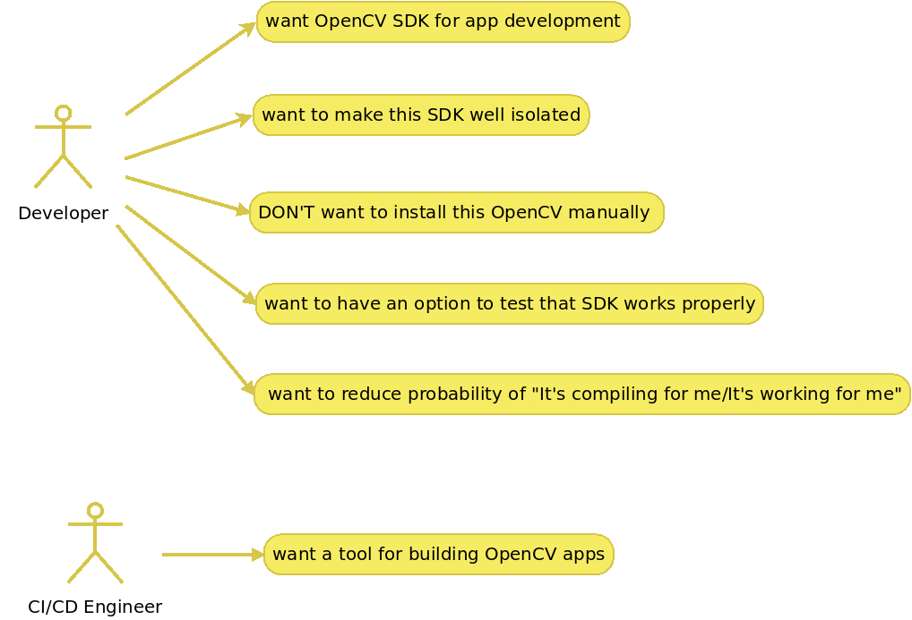

<div align="center">
    
</div>

# Intro
    OpenCV 4.6.0 SDK isolated into a docker continer
    Docker image with opencv 4.6.0 and basic dev tools

---


# Use-cases
- As a developer I want OpenCV SDK for app development
- As a developer I want to make this SDK well isolated, installing directly into host and making host messy is bad idea
- As a developer I DON'T want to install this OpenCV manually from command line since it's OS specific and not cool
- As a developer I want to have an option to test that SDK works properly
- As a developer I want to reduce probability of ***It's compiling for me/It's working for me*** cases
- As CI/CD engineer I want a tool for building OpenCV apps right from let say Jenkins

<div align="center">
    
</div>

---


### Details
Having SDK as docker image shall unify dev environment for all delevelopers and CI/CD engineers therefore solving that ***It's compiling for me/It's working for me*** case.

Apart from OpenCV SDK docker image contains some basic tools: 
* vim
* mc
* curl/wget
* cmake/gcc/g++
* python2 & python3
* xeyes (for testing X forwarding to host)
* other common tools

SDK has few special entrypoints for testing SDK functionality:
* /home/dev_factory_opencv_sdk/test.sh
* /home/dev_factory_opencv_sdk/test.performance.sh
* /home/dev_factory_opencv_sdk/test.python.sh

---


### X server configuration

Some test apps like ***opencv4/samples/python/digits.py*** use UI for drawing.
Therefore X forwarding shall be setup.
X forwarding is already setup this way:
- .Xauthority and /tmp/.X11-unix:/ are mounted into SDK container.
- DISPLAY is assigned for SDK container

Have to enable access to hosts' X server to let X apps running on hosts's DISPLAY by running
```
$ xhost +local: 
````

---


# Commands

### To build SDK image
```
$ bash ./build.sh dev_factory_opencv_sdk
```

---


### To run SDK image
```
$ bash ./run.sh dev_factory_opencv_sdk
```

---


### To test SDK image
```
$ bash ./run.sh dev_factory_opencv_sdk --entrypoint="/home/dev_factory_opencv_sdk/test.sh"
```

---


### To test SDK python example
```
$ bash ./run.sh dev_factory_opencv_sdk --entrypoint="/home/dev_factory_opencv_sdk/test.python.sh"
```

---


### To run SDK performance tests
```
$ bash ./run.sh dev_factory_opencv_sdk --entrypoint="/home/dev_factory_opencv_sdk/test.performance.sh"
```

---


### To pull SDK image
```
$ docker pull <registry>:<port>/dev_factory_opencv_sdk:<tag>
```


