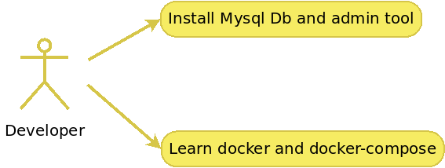

<div align="center">
    
</div>

# Intro
Docker image with OpenCV, math tools and basic dev tools:
* OpenCV="4.8.0"
* numpy="1.16.2"
* opencv-python="4.8.*"

---


# Use-cases
- As a developer I want OpenCV SDK for app development
- As a developer I want to make this SDK well isolated, installing directly into host and making host messy is bad idea
- As a developer I DON'T want to install this OpenCV manually from command line since it's OS specific and not cool
- As a developer I want to have an option to test that SDK works properly
- As a developer I want to reduce probability of ***It's compiling for me/It's working for me*** cases
- As CI/CD engineer I want a tool for building OpenCV apps right from let say Jenkins

<div align="center">
    
</div>

---


### Details
Having SDK as docker image shall unify dev environment for all delevelopers and CI/CD engineers therefore solving that ***It's compiling for me/It's working for me*** case.

Apart from OpenCV SDK docker image contains some basic tools: 
* vim
* mc
* curl/wget
* cmake/gcc/g++
* python2 & python3
* xeyes (for testing X forwarding to host)
* other common tools

SDK has few special entrypoints for testing SDK functionality:
* /home/dev_factory_opencv_sdk/test.sh
* /home/dev_factory_opencv_sdk/test.performance.sh
* /home/dev_factory_opencv_sdk/test.python.sh

---


### X server configuration

Some test apps like ***opencv4/samples/python/digits.py*** use UI for drawing.
Therefore X forwarding shall be setup.
X forwarding is already setup this way:
- .Xauthority and /tmp/.X11-unix:/ are mounted into SDK container.
- DISPLAY is assigned for SDK container

Have to enable access to hosts' X server to let X apps running on hosts's DISPLAY by running
```
$ xhost +local: 
````

---


# Commands

### To build SDK image
```
$ bash ./build.sh dev_factory_opencv_sdk
```

---


### To run SDK image
```
$ bash ./run.sh dev_factory_opencv_sdk
```

---


### To test SDK image
```
$ bash ./run.sh dev_factory_opencv_sdk --entrypoint="/home/dev_factory_opencv_sdk/test.sh"
```

---


### To test SDK python example
```
$ bash ./run.sh dev_factory_opencv_sdk --entrypoint="/home/dev_factory_opencv_sdk/test.python.sh"
```

---


### To run SDK performance tests
```
$ bash ./run.sh dev_factory_opencv_sdk --entrypoint="/home/dev_factory_opencv_sdk/test.performance.sh"
```

---


### To pull SDK image
```
$ docker pull <registry>:<port>/dev_factory_opencv_sdk:<tag>
```

---


# Developing with SDK docker image
SDK contains [OpenCV](https://docs.opencv.org/4.8.0/) version ***4.8.0***

---


## Code syncup between host and SDK container
The whole ***src*** folder is mounted into SDK container by ***run.sh*** script.
Therefor the best option to deploy any codebase into SDK container for build purpose you shall:
 * Copy your codebase into ***src*** folder
 * Update ***run.sh*** script and mount any hosts foder containing a codebase into SDK container

Using mounting into SDK container makes any changes inside of a mounted folder, ***src*** for instance,  appear in SDK container and vice-versa.

---


## Buiding examples
The ***src*** folder contains a set of custom OpenCV examples.
Every example contains buiding and running instauctions.

Examples list:
* [src/examples/DisplayImage](src/examples/DisplayImage/README.md)

---


## Building procedures
Building a procect can be don by many ways.

---


### Buiding inside SDK container manually
In this case SDK conatiner is run like this:
```
bash run.sh
```

All building procedures are done inside SDK container manually.\
Mentioned above ***DisplayImage*** documents use this option, all build commands issued manually.\
Check [src/examples/DisplayImage](src/examples/DisplayImage/README.md)

---


### Buiding and running inside SDK container, providing a special entrypoint
In this case a project meant to be built shall have a build script.\
This script is used as an antrypoint once SDK container, container gets started calls that build script, gets things done and stops.

---


***DisplayImage*** example has such a build script named build.sh.
To build the example:
```
bash ./run.sh dev_factory_opencv_sdk --entrypoint="/home/dev_factory_opencv_sdk/src/examples/DisplayImage/build.sh"
```

<div align="center">
    
</div>

---


***DisplayImage*** example also has a run script named run.sh.
To run the example:
```
bash ./run.sh dev_factory_opencv_sdk --entrypoint="/home/dev_factory_opencv_sdk/src/examples/DisplayImage/run.sh"

```

<div align="center">
    
</div>

