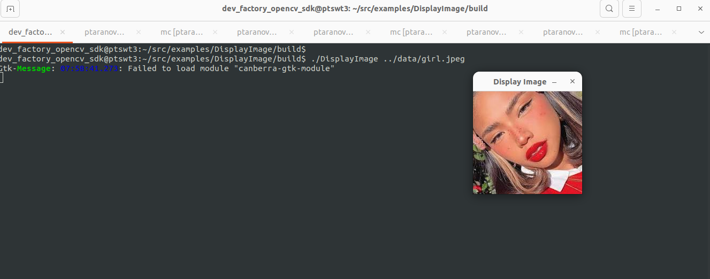
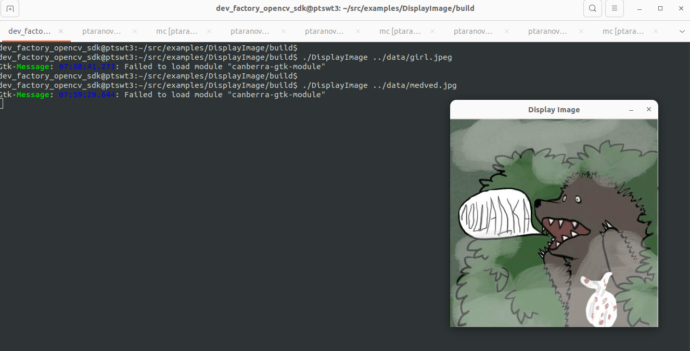

# Intro
Very vasic OpenCV example written with C++.
Simply displays a given image file.


# Building
```
mkdir build && cd build
cmake ..
make -j$(nproc)
```


# Testing
This example contains a very basic set of test data located in ***data*** folder.\
Therefor to display any image file from ***data*** folder:

```
./DisplayImage ../data/girl.jpeg
```

<div align="center">
    
</div>


or

```
./DisplayImage ../data/medved.jpeg
```

<div align="center">
    
</div>

